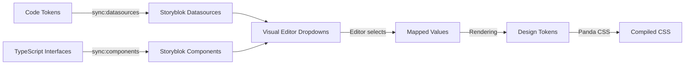

## Setup

1. **Add environment variables** to `.env.local`:

```bash
# Get from: https://app.storyblok.com/#!/me/account?tab=token
STORYBLOK_MANAGEMENT_TOKEN=your-personal-access-token

# Find in: Storyblok Settings → General
STORYBLOK_SPACE_ID=your-space-id
```

2. **Sync component groups** (folders):

```bash
pnpm --filter @httpjpg/storyblok-sync sync:groups
```

3. **Sync datasources** (design tokens):

```bash
pnpm --filter @httpjpg/storyblok-sync sync:datasources
```

4. **Sync components** (schemas):

```bash
pnpm --filter @httpjpg/storyblok-sync sync:components
```

5. **Or sync everything** (runs all in correct order):

```bash
pnpm --filter @httpjpg/storyblok-sync sync:all
```

## What Gets Created

### Datasources (11 total)

**Spacing & Layout:**
- `spacing-options` - None, XS, Small, Medium, Large, XL, 2XL, 3XL, 4XL
- `width-options` - Full Width, Container, Narrow
- `grid-columns` - 1-6 Columns, Auto Fit
- `aspect-ratio-options` - 16:9, 4:3, 1:1, 3:4, 9:16, 21:9

**Colors:**
- `background-color-options` - White, Black, Gray, Primary, Accent
- `text-color-options` - Text colors

**Typography:**
- `font-family` - Sans, Headline, Accent, Mono
- `font-size` - Small, Medium, Base, Large, XL
- `font-weight` - Light, Normal, Medium, Semibold, Bold, Black

**Animations:**
- `animation-duration` - Fast, Normal, Slow
- `animation-easing` - Linear, Ease, Ease In/Out

### Component Groups (3 folders)

Organize components in the Block Library:
- 📁 **Layout** - Section, Container, Grid
- 📁 **Content** - Headline, Paragraph
- 📁 **Media** - Image, Video, Slideshow

### Components (8 total)

**Layout** (📁):
- `section` - Semantic section wrapper with responsive spacing
- `container` - Content container with width options
- `grid` - Responsive grid layout

**Content** (📁):
- `headline` - H1-H3 headings with styling options
- `paragraph` - Body text with styling options

**Media** (📁):
- `image` - Responsive images with aspect ratio
- `video` - Video player (Asset/YouTube/Vimeo)
- `slideshow` - Image carousel

Each component includes:
- ✅ Custom icon and color
- ✅ Field descriptions and tooltips
- ✅ Datasource integration for token-based values
- ✅ Component whitelists for nested blocks

## Using in Storyblok

### Step 1: Component Schemas
Components are automatically available in Visual Editor after sync.

### Step 2: Configure Fields
For dropdown fields:
1. Edit component schema
2. Find field (e.g., "Padding Top")
3. Set "Source" to "Datasource"
4. Select datasource (e.g., "spacing-options")

### Step 3: Nested Bloks
For `content` or `body` fields:
1. Edit component schema
2. Find bloks field
3. Configure "Allowed Components" whitelist
4. Add components that can be nested

## Example: Creating a Page

In Storyblok Visual Editor:

1. Create new story
2. Add `section` component
3. Configure spacing:
   - Padding Top: "Medium" → maps to `8` → 2rem
   - Padding Bottom: "Large" → maps to `16` → 4rem
4. Add nested components to `content`:
   - Add `headline` with text "Hello World"
   - Add `paragraph` with body text
5. Preview updates live!

## Workflow



## See Also

- Full docs: `packages/storyblok-sync/README.md`
- Datasource docs: `docs/STORYBLOK_DATASOURCES.md`
- Example components: `docs/STORYBLOK_DATASOURCES_EXAMPLES.md`
